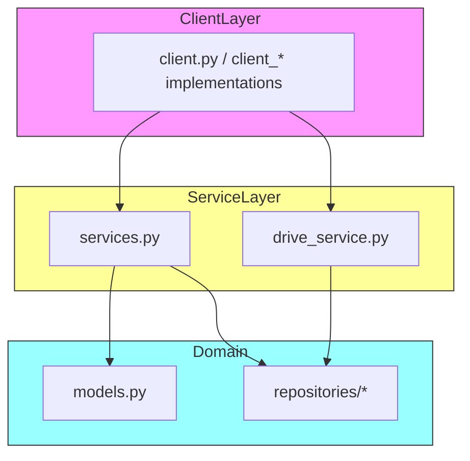

# classroom_api_client

Google Classroom API client library and runner.

This repository contains a small client and helpers for interacting with
Google Classroom-like services. It bundles client implementations, service
wrappers, data models and simple repository abstractions for working with
courses, coursework, students and submissions.

Key features

- Lightweight client modules supporting different auth modes (see `client_oauth.py`, `client_hybrid.py`, `client_old.py`).
- Service wrappers in `drive_service.py` and `services.py` that encapsulate API calls.
- Domain models in `models.py` and repository patterns in `repositories/`.
- A comprehensive CLI with grading functionality including new "push" style commands for bulk operations.
- A tiny runner `main.py` which demonstrates how the client modules can be used.

Project layout (important files)

- `main.py` — example runner / entrypoint
- `src/client.py` — primary client surface (high-level orchestrator)
- `src/client_oauth.py` — OAuth-based client implementation
- `src/client_hybrid.py` — hybrid auth client (token + service account patterns)
- `src/drive_service.py` — Drive integration helpers
- `src/services.py` — higher level Classroom service wrappers
- `src/models.py` — data models used across services/repositories
- `src/repositories/` — repositories for Course, Coursework, Student, Submission

Quick start

1. Create a virtualenv and install dependencies. This project uses `pyproject.toml`.

Using pip:

```bash
python -m venv .venv
source .venv/bin/activate
python -m pip install -U pip
python -m pip install -e .
```

Or using uv:

```bash
uv install
```

1. Run the example runner

```bash
python main.py
```

## New Grading Commands

The CLI now includes comprehensive grading functionality with new "push" style commands:

```bash
# Bulk grading - assign same grade to all submissions
python main.py submission grade-all COURSEWORK_ID 85.0

# Push draft grades to final - make draft grades visible to students  
python main.py submission push-draft-grades COURSEWORK_ID

# Push grades from CSV file - import grades from spreadsheet
python main.py submission push-grades-from-file COURSEWORK_ID grades.csv

# Interactive bulk grading - flexible command-line interface
python main.py submission push-grades-bulk COURSEWORK_ID

# Show comprehensive help for all grading commands
python main.py submission grading-help
```

For detailed documentation, examples, and workflows, see [docs/new_grading_commands.md](docs/new_grading_commands.md).

1. Import and use the client from code

```py
from src import client

# This is a minimal example — adapt to the client class in `src/client.py`.
c = client.Client()  # constructor/interface may vary
courses = c.list_courses()
print(courses)
```

Mermaid architecture (component view)



Notes and assumptions

- The README and docs were authored from the code layout in the repository. I assumed the package is importable as `src` for local development; if you prefer a different import layout (for example a package name defined in `pyproject.toml`) adjust the examples accordingly.
- Authentication and exact client constructors vary between `client_*.py` implementations — consult those files for specific parameters and flows.

Where to go next

- Read `docs/architeture.md` for a deeper explanation and sequence diagrams.
- Inspect `src/client_oauth.py` and `src/client_hybrid.py` for auth examples.
