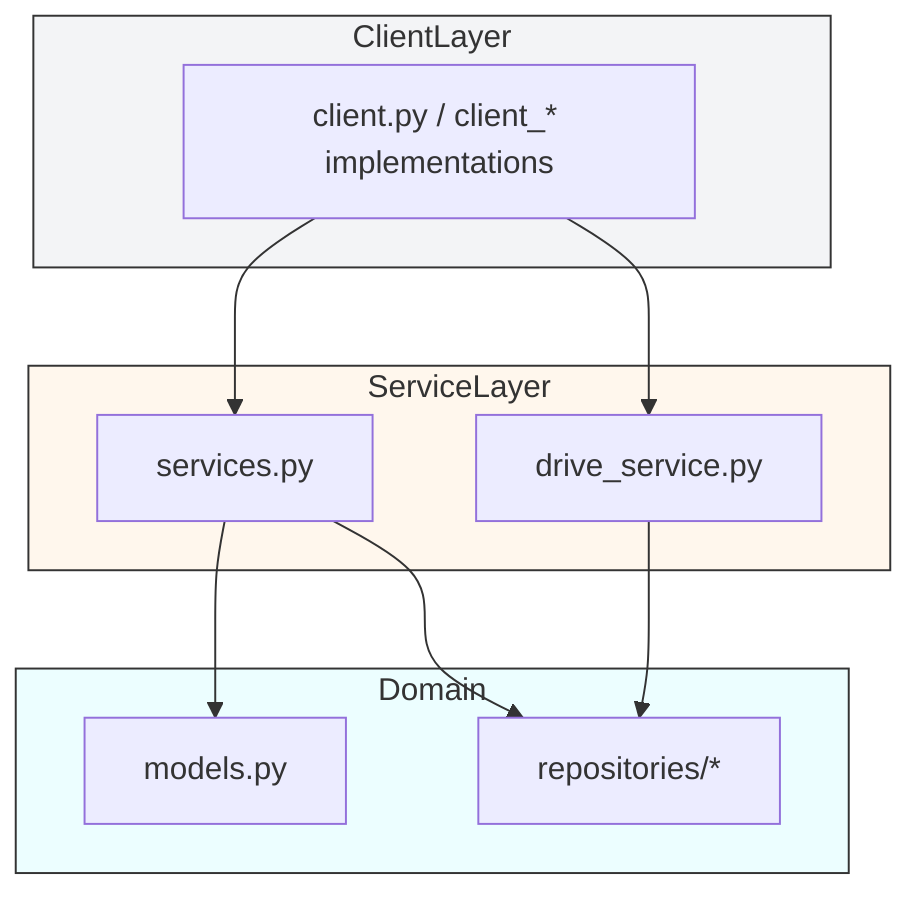
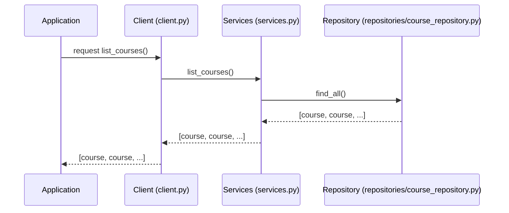

# Architecture

This document explains the high-level architecture of the `classroom_api_client` project and contains Mermaid diagrams (component and sequence) to help visualize how the pieces interact.

## Overview

The project follows a small layered architecture:

- Client layer: lightweight client implementations that handle auth and provide a high-level surface (`client.py`, `client_oauth.py`, `client_hybrid.py`).
- Service layer: wrappers that implement domain operations using the client and any external integrations (`services.py`, `drive_service.py`).
- Domain layer: models and repositories that represent application data and persistence-like logic (`models.py`, `repositories/*`).

The code is intentionally small and modular so different auth strategies can be implemented and swapped easily.

## Component diagram

## Typical sequence: list courses

This sequence shows a typical read operation where a consumer requests a list of courses.

## Notes and extension points

- Authentication: each `client_*` implementation isolates auth details. Add a new auth flow by adding a new `client_xxx.py` that implements the same surface (e.g., `list_courses`, `get_course`).
- Error handling: services should map transport errors into domain-level exceptions (not currently enforced by this small sample).
- Persistence: repositories are in-memory or light wrappers; replace them with DB-backed implementations if needed.

## Where to look next

- `src/client_oauth.py` and `src/client_hybrid.py` for concrete authentication examples.
- `src/services.py` for domain orchestration code.
- `src/repositories` for how data is modeled and fetched.

